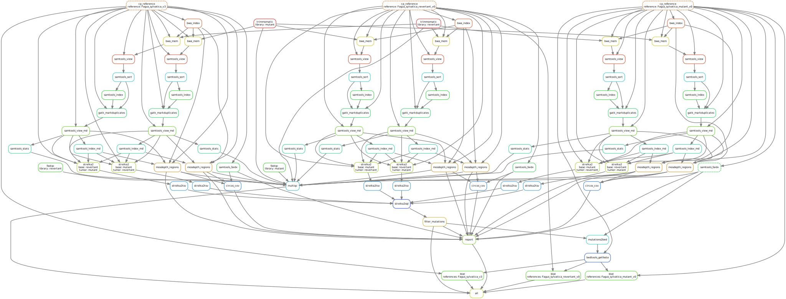

```{r setup, include=FALSE}
rm(list = ls()) ; invisible(gc()) ; set.seed(42)
library(knitr)
library(kableExtra)
if(knitr:::is_html_output()) options(knitr.table.format = "html") 
if(knitr:::is_latex_output()) options(knitr.table.format = "latex") 
library(tidyverse)
theme_set(bayesplot::theme_default())
opts_chunk$set(echo = F, message = F, warning = F, fig.height = 6, fig.width = 8,
               cache = F, cache.lazy = F)
```

Development of a [`singularity` & `snakemake`](https://github.com/sylvainschmitt/snakemake_singularity) workflow to detect mutations with several alignment and mutation detection tools.

# Align

*Align reads against reference.*

## bwa

### bwa map

*Align in sam.*

* Rules: [`bwa_map`](https://github.com/sylvainschmitt/detectMutations/blob/main/rules/bwa_map.smk)
* Tools: [`BWA mem`](http://bio-bwa.sourceforge.net/bwa.shtml)
* Singularity: oras://registry.forgemia.inra.fr/gafl/singularity/bwa/bwa:latest

### PICARD SortSam

### samtools index

### samtools view

*Convert sam to bam.*

* Rules: [`samtools_view`](https://github.com/sylvainschmitt/detectMutations/blob/main/rules/samtools_view.smk)
* Tools: [`samtools view`](http://www.htslib.org/doc/samtools-view.html)
* Singularity: oras://registry.forgemia.inra.fr/gafl/singularity/samtools/samtools:latest

### samtools index

### samtools sort

## GEM

## Novoalign

# Detect

*Detect and filter mutations in alignments.*

## Mutect2

* Rules: [`mutect2`](https://github.com/sylvainschmitt/generateMutations/blob/main/rules/mutect2.smk)
* Tools: [`Mutect2`](https://gatk.broadinstitute.org/hc/en-us/articles/360037593851-Mutect2)
* Singularity: docker://alexcoppe/gatk

# Miscellaneous

## Commands

*To run locally.*

```{bash, eval=F, echo=T}
snakemake -np 
snakemake --dag | dot -Tsvg > dag/dag.svg
snakemake --use-singularity --cores 4
snakemake --use-singularity --cores 1 --verbose
snakemake --report report.html
```

*To run on HPC.*

```{bash, eval=F, echo=T}
module purge ; module load bioinfo/snakemake-5.8.1 # for test on node
snakemake -np # dry run
sbatch job.sh ; watch 'squeue -u sschmitt' # run
less genMut.*.err # snakemake outputs, use MAJ+F
less genMut.*.out # snakemake outputs, use MAJ+F
snakemake --dag | dot -Tsvg > dag/dag.svg # dag
module purge ; module load bioinfo/snakemake-5.8.1 ; module load system/Python-3.6.3 # for report
snakemake --report report.html # report
```

## Direct Acyclic Graph

*Represent rules.*

```{r }

```

## Resources

* [TreeMutation pages](https://treemutation.netlify.app/mutations-detection.html#in-silico-mutations)
