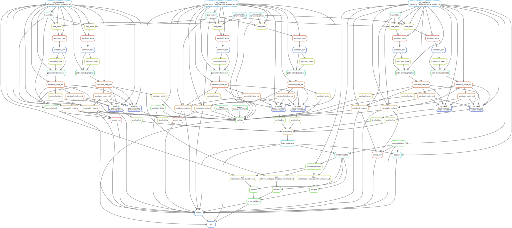

```{r setup, include=FALSE}
rm(list = ls()) ; invisible(gc()) ; set.seed(42)
library(knitr)
library(kableExtra)
if(knitr:::is_html_output()) options(knitr.table.format = "html") 
if(knitr:::is_latex_output()) options(knitr.table.format = "latex") 
library(tidyverse)
library(vcfR)
library(Biostrings)
theme_set(bayesplot::theme_default())
opts_chunk$set(echo = F, message = F, warning = F, fig.height = 6, fig.width = 8,
               cache = F, cache.lazy = F)
```

[`singularity` & `snakemake`](https://github.com/sylvainschmitt/snakemake_singularity) workflow to detect mutations with several alignment and mutation detection tools.

```{r dag}

```

# Installation

- [x] Python ≥3.5
- [x] Snakemake ≥5.24.1
- [x] Golang ≥1.15.2
- [x] Singularity ≥3.7.3
- [x] This workflow

```{bash, eval=F, echo=T}
# Python
sudo apt-get install python3.5
# Snakemake
sudo apt install snakemake`
# Golang
export VERSION=1.15.8 OS=linux ARCH=amd64  # change this as you need
wget -O /tmp/go${VERSION}.${OS}-${ARCH}.tar.gz https://dl.google.com/go/go${VERSION}.${OS}-${ARCH}.tar.gz && \
sudo tar -C /usr/local -xzf /tmp/go${VERSION}.${OS}-${ARCH}.tar.gz
echo 'export GOPATH=${HOME}/go' >> ~/.bashrc && \
echo 'export PATH=/usr/local/go/bin:${PATH}:${GOPATH}/bin' >> ~/.bashrc && \
source ~/.bashrc
# Singularity
mkdir -p ${GOPATH}/src/github.com/sylabs && \
  cd ${GOPATH}/src/github.com/sylabs && \
  git clone https://github.com/sylabs/singularity.git && \
  cd singularity
git checkout v3.7.3
cd ${GOPATH}/src/github.com/sylabs/singularity && \
  ./mconfig && \
  cd ./builddir && \
  make && \
  sudo make install
# detect Mutations
git clone git@github.com:sylvainschmitt/detectMutations.git
cd detectMutations
```

# Usage

## Get data

*Generate data using the [generate Mutations](https://github.com/sylvainschmitt/generateMutations) workflow.*

```{bash, eval=F, echo=T}
git clone git@github.com:sylvainschmitt/generateMutations.git
cd ../generateMutations
snakemake --use-singularity --cores 4
cd ../detectMutations
bash scripts/get_data.sh
```

## Locally

```{bash, eval=F, echo=T}
snakemake -np # dry run
snakemake --dag | dot -Tsvg > dag/dag.svg # dag
snakemake --use-singularity --cores 4 # run
snakemake --use-singularity --cores 1 --verbose # debug
snakemake --report report.html # report
```

## HPC

```{bash, eval=F, echo=T}
module purge ; module load bioinfo/snakemake-5.25.0 # for test on node
snakemake -np # dry run
sbatch job.sh ; watch 'squeue -u sschmitt' # run
less detMut.*.err # snakemake outputs, use MAJ+F
less detMut.*.out # snakemake outputs, use MAJ+F
snakemake --dag | dot -Tsvg > dag/dag.svg # dag
module purge ; module load bioinfo/snakemake-5.8.1 ; module load system/Python-3.6.3 # for report
snakemake --report report.html # report
module purge ; module load system/R-3.6.2 ; R # to build results
```

# Workflow

## Reference

*Copy and index reference and SNPs for software to work with.*

### [cp_reference](https://github.com/sylvainschmitt/detectMutations/blob/main/rules/cp_reference.smk)

* Tools: `cp`

### [bwa_index](https://github.com/sylvainschmitt/detectMutations/blob/main/rules/bwa_index.smk)

* Tools: [`BWA index`](http://bio-bwa.sourceforge.net/bwa.shtml)
* Singularity: oras://registry.forgemia.inra.fr/gafl/singularity/bwa/bwa:latest

### [samtools_faidx](https://github.com/sylvainschmitt/detectMutations/blob/main/rules/samtools_faidx.smk)

* Tools: [`samtools faidx`](http://www.htslib.org/doc/samtools-faidx.html)
* Singularity: oras://registry.forgemia.inra.fr/gafl/singularity/samtools/samtools:latest

### [gatk_dict](https://github.com/sylvainschmitt/detectMutations/blob/main/rules/gatk_dict.smk)

* Tools: [`gatk CreateSequenceDictionary`](https://gatk.broadinstitute.org/hc/en-us/articles/360036729911-CreateSequenceDictionary-Picard-)
* Singularity: docker://broadinstitute/gatk

### [cp_snps](https://github.com/sylvainschmitt/detectMutations/blob/main/rules/cp_snps.smk)

* Tools: `cp`

### [gatk_idx](https://github.com/sylvainschmitt/detectMutations/blob/main/rules/gatk_idx.smk)

* Tools: [`gatk IndexFeatureFile`](https://gatk.broadinstitute.org/hc/en-us/articles/360037428111-IndexFeatureFile)
* Singularity: docker://broadinstitute/gatk

## Reads

*Copy reads, report quality and trim.*

### [cp_reads](https://github.com/sylvainschmitt/detectMutations/blob/main/rules/cp_reads.smk)

* Tools: `cp`

### [fastqc](https://github.com/sylvainschmitt/detectMutations/blob/main/rules/fastqc.smk)

* Tools: [`fastQC`](https://www.bioinformatics.babraham.ac.uk/projects/fastqc/Help/)
* Singularity: docker://biocontainers/fastqc:v0.11.9_cv8


### [trimmomatic](https://github.com/sylvainschmitt/detectMutations/blob/main/rules/trimmomatic.smk)

* Tools: [`Trimmomatic`](http://www.usadellab.org/cms/uploads/supplementary/Trimmomatic/TrimmomaticManual_V0.32.pdf)
* Singularity: oras://registry.forgemia.inra.fr/gafl/singularity/trimmomatic/trimmomatic:latest

## Alignments

*Align reads against reference, mark duplicated, and report alignment quality.*

### [bwa_mem](https://github.com/sylvainschmitt/detectMutations/blob/main/rules/bwa_mem.smk)

* Tools: [`BWA mem`](http://bio-bwa.sourceforge.net/bwa.shtml)
* Singularity: oras://registry.forgemia.inra.fr/gafl/singularity/bwa/bwa:latest

### [samtools_sort](https://github.com/sylvainschmitt/detectMutations/blob/main/rules/samtools_sort.smk)

* Tools: [`Samtools sort`](http://www.htslib.org/doc/samtools-sort.html)
* Singularity: oras://registry.forgemia.inra.fr/gafl/singularity/samtools/samtools:latest

### [samtools_index](https://github.com/sylvainschmitt/detectMutations/blob/main/rules/samtools_index.smk)

* Tools: [`Samtools index`](http://www.htslib.org/doc/samtools-index.html)
* Singularity: oras://registry.forgemia.inra.fr/gafl/singularity/samtools/samtools:latest

### [gatk_markduplicates](https://github.com/sylvainschmitt/detectMutations/blob/main/rules/gatk_markduplicates.smk)

* Tools: [`gatk MarkDuplicates`](https://gatk.broadinstitute.org/hc/en-us/articles/360037052812-MarkDuplicates-Picard-)
* Singularity: docker://broadinstitute/gatk

### [samtools_index_md](https://github.com/sylvainschmitt/detectMutations/blob/main/rules/samtools_index_md.smk)

* Tools: [`Samtools index`](http://www.htslib.org/doc/samtools-index.html)
* Singularity: oras://registry.forgemia.inra.fr/gafl/singularity/samtools/samtools:latest

### [samtools_stats](https://github.com/sylvainschmitt/detectMutations/blob/main/rules/samtools_stats.smk)

* Tools: [`Samtools stats`](http://www.htslib.org/doc/samtools-stats.html)
* Singularity: oras://registry.forgemia.inra.fr/gafl/singularity/samtools/samtools:latest

### [qualimap](https://github.com/sylvainschmitt/detectMutations/blob/main/rules/qualimap.smk)

* Tools: [`QualiMap`](http://qualimap.conesalab.org/doc_html/command_line.html)
* Singularity: docker://pegi3s/qualimap

## Mutation

*Detect mutations.*

#### [cp_vcfs](https://github.com/sylvainschmitt/detectMutations/blob/main/rules/cp_vcfs.smk)

* Tools: `cp`

### Mutect2

#### [gatk_mutect2](https://github.com/sylvainschmitt/detectMutations/blob/main/rules/gatk_mutect2.smk)

* Tools: [`gatk Mutect2`](https://gatk.broadinstitute.org/hc/en-us/articles/360037593851-Mutect2)
* Singularity: docker://broadinstitute/gatk

### freebayes

#### [freebayes](https://github.com/sylvainschmitt/detectMutations/blob/main/rules/freebayes.smk)

* Tools: [`freebayes`](https://github.com/freebayes/freebayes)
* Singularity: oras://registry.forgemia.inra.fr/gafl/singularity/freebayes/freebayes:latest


#### [bedtools_substract](https://github.com/sylvainschmitt/detectMutations/blob/main/rules/bedtools_substract.smk)

* Tools: [`bedtools substract`](https://bedtools.readthedocs.io/en/latest/content/tools/subtract.html)
* Singularity: oras://registry.forgemia.inra.fr/gafl/singularity/bedtools/bedtools:latest

### GATK

#### [gatk_haplotypecaller](https://github.com/sylvainschmitt/detectMutations/blob/main/rules/gatk_haplotypecaller.smk)

* Tools: [`gatk HaplotypeCaller`](https://gatk.broadinstitute.org/hc/en-us/articles/360037225632-HaplotypeCaller)
* Singularity: docker://broadinstitute/gatk

#### [gatk_genotypegvcfs](https://github.com/sylvainschmitt/detectMutations/blob/main/rules/gatk_genotypegvcfs.smk)

* Tools: [`gatk GenotypeGVCFs`](https://gatk.broadinstitute.org/hc/en-us/articles/360037057852-GenotypeGVCFs)
* Singularity: docker://broadinstitute/gatk

#### [bedtools_substract](https://github.com/sylvainschmitt/detectMutations/blob/main/rules/bedtools_substract.smk)

* Tools: [`bedtools substract`](https://bedtools.readthedocs.io/en/latest/content/tools/subtract.html)
* Singularity: oras://registry.forgemia.inra.fr/gafl/singularity/bedtools/bedtools:latest

### Strelka2

#### [manta](https://github.com/sylvainschmitt/detectMutations/blob/main/rules/manta.smk)

* Tools: [`Manta`](https://github.com/Illumina/manta)
* Singularity: docker://quay.io/wtsicgp/strelka2-manta

#### [strelka2](https://github.com/sylvainschmitt/detectMutations/blob/main/rules/strelka2.smk)

* Tools: [`Strelka2`](https://github.com/Illumina/strelka)
* Singularity: docker://quay.io/wtsicgp/strelka2-manta

### Manta

#### [manta](https://github.com/sylvainschmitt/detectMutations/blob/main/rules/manta.smk)

* Tools: [`Manta`](https://github.com/Illumina/manta)
* Singularity: docker://quay.io/wtsicgp/strelka2-manta


### VarScan

#### [varscan](https://github.com/sylvainschmitt/detectMutations/blob/main/rules/varscan.smk)

* Tools: [`VarScan`](https://wiki.bits.vib.be/index.php/Varscan2#calling_SNVs)
* Singularity: docker://alexcoppe/varscan

#### [varscan2vcf](https://github.com/sylvainschmitt/detectMutations/blob/main/rules/varscan2vcf.smk)

* Script: [`varscan2vcf.R`](https://github.com/sylvainschmitt/detectMutations/blob/main/scripts/varscan2vcf.R)
* Singularity: https://github.com/sylvainschmitt/singularity-template/releases/download/0.0.1/sylvainschmitt-singularity-tidyverse-Biostrings.latest.sif

### Somatic Sniper

#### [somaticsniper](https://github.com/sylvainschmitt/detectMutations/blob/main/rules/somaticsniper.smk)

* Tools: [`Somatic Sniper`](http://gmt.genome.wustl.edu/packages/somatic-sniper/)
* Singularity: docker://lethalfang/somaticsniper:1.0.5.0

#### [bedtools_substract](https://github.com/sylvainschmitt/detectMutations/blob/main/rules/bedtools_substract.smk)

* Tools: [`bedtools substract`](https://bedtools.readthedocs.io/en/latest/content/tools/subtract.html)
* Singularity: oras://registry.forgemia.inra.fr/gafl/singularity/bedtools/bedtools:latest

### CaVEMan 

**BUG!**

#### [caveman](https://github.com/sylvainschmitt/detectMutations/blob/main/rules/caveman.smk)

* Tools: [`CaVEMan`](https://github.com/cancerit/CaVEMan)
* Singularity: docker://leukgen/docker-caveman:v1.0.0

### MuSe 

#### [muse](https://github.com/sylvainschmitt/detectMutations/blob/main/rules/muse.smk)

* Tools: [`MuSe`](https://bioinformatics.mdanderson.org/public-software/muse/ )
* Singularity: docker://opengenomics/muse

### RADIA

**BUG!**

#### [radia](https://github.com/sylvainschmitt/detectMutations/blob/main/rules/radia.smk)

* Tools: [`RADIA`](https://github.com/aradenbaugh/radia/)
* Singularity: docker://opengenomics/radia

## Quality check

*Combined quality information from `QualiMap`, `Picard`, `Samtools`, `Trimmomatic`, and `FastQC` (see previous steps).*

### [multiqc](https://github.com/sylvainschmitt/detectMutations/blob/main/rules/multiqc.smk)

* Tools: [`MultiQC`](https://multiqc.info/)
* Singularity: oras://registry.forgemia.inra.fr/gafl/singularity/multiqc/multiqc:latest

# Results

```{r get_stats, eval=F}
options(dplyr.summarise.inform = FALSE)
get_stats <- function(callfile, mutationsfile){
  # print(callfile) ; print(mutationsfile) # debug
  # callfile <- "results/N100_R2_AF0.1_NR7000/varscan/N100_R2_AF0.1_NR7000.vcf"
  # mutationsfile <- "../generateMutations/results/reference//../mutations/Qrob_PM1N_7k_Qrob_Chr01_mutated_N100_R2.tsv"
  mutations <- read_tsv(mutationsfile, col_types = cols(
    CHROM = col_character(),
    POS = col_double(),
    REF = col_character(),
    TYPE = col_character(),
    ALT = col_character()
  )) %>% 
    mutate(True = 1) %>%
    filter(REF != "N")
  call <- try(vcfR::read.vcfR(callfile, verbose = F)@fix, silent = T)
  if(!inherits(call, "try-error")){
    call <- as.data.frame(call) %>% 
      mutate_at(c("CHROM", "REF", "ALT"), as.character) %>% 
      mutate(POS = as.numeric(as.character(POS))) %>% 
      mutate(Called = 1) %>% 
      mutate(REF = substr(REF, 1, 1), ALT = substr(ALT, 1, 1))
  } else {
    call <- data.frame(CHROM = character(), POS = double(), REF = character(), ALT = character(), Called = integer())
  }
  stats <- full_join(mutations, call, by = c("CHROM", "POS", "REF", "ALT")) %>% 
    mutate_at(c("True", "Called"), funs(ifelse(is.na(.), 0, .))) %>% 
    mutate(Confusion = recode(paste0(True, Called), "01" = "FP", "10" = "FN", "11" = "TP")) %>% 
    group_by(Confusion) %>% 
    summarise(N = n()) %>% 
    reshape2::dcast(. ~ Confusion, value.var = "N")
  if(!("FP" %in% names(stats)))
     stats$FP <- 0
  if(!("FN" %in% names(stats)))
     stats$FN <- 0
  if(!("TP" %in% names(stats)))
     stats$TP <- 0
  stats <- mutate(stats, Precision = round(TP/(TP+FP), 2), Recall = round(TP/(TP+FN), 2))
  return(stats)
}
```

```{r stats, eval=F}
config.file <- "config.dev.yml"
config <- yaml::read_yaml(file.path("config", config.file))
refL <- width(readDNAStringSet(file.path(config$refdir, paste0(config$reference, ".fa"))))
data.frame(vcf = list.files("results/mutations", full.names = T)) %>% 
  mutate(vcf = as.character(vcf)) %>% 
  mutate(libraries = gsub("results/mutations/", "", vcf)) %>% 
  mutate(libraries = gsub(".vcf", "", libraries)) %>% 
  separate(libraries, c("N", "R", "AF", "NR", "caller"), sep = "_") %>% 
  mutate_at(c("N", "R", "AF", "NR"), funs(as.numeric(gsub("[[:alpha:]]", "", .)))) %>% 
  mutate(mutations = file.path("..", "generateMutations", "results", "mutations", 
                               paste0(config$reference, "_mutated_N", N, "_R", R, ".tsv"))) %>% 
  group_by(N, R, AF, NR, caller) %>% 
  do(stats = get_stats(.$vcf, .$mutations)) %>% 
  unnest(stats) %>% 
  select(-`.`) %>% 
  mutate(C = round((NR*150)/refL)) %>% 
  select(caller, N, R, AF, C, FN, FP, TP, Precision, Recall) %>% 
  write_tsv("stats.dev.tsv")
```

```{r statsFig, fig.cap="Caller assesment."}
read_tsv("stats.dev.tsv") %>% 
  filter(caller != "manta") %>% 
  mutate(C = as.numeric(recode(as.character(C), "49" = "50", "99" = "100",
                               "148" = "150", "198" = "200"))) %>% 
  reshape2::melt(c("caller", "FN", "FP", "TP", "Precision", "Recall"),
                 variable.name = "parameter", value.name = "parameter.value") %>% 
  reshape2::melt(c("caller", "parameter", "parameter.value"),
                 variable.name = "metric", value.name = "metric.value") %>% 
  filter(metric %in% c("Precision", "Recall")) %>% 
  filter(parameter != "N") %>% 
  mutate(parameter = recode(parameter, "N" = "Number\nof mutations", "R" = "Transition\nTransversion Ratio",
                            "AF" = "Allele\nFrequency", "C" = "Coverage")) %>% 
    mutate(caller = recode(caller,    
                         "mutect2" = "Mutect2", 
                         "freebayes" = "freebayes", 
                         "gatk" = "GATK", 
                         "strelka2" = "Strelka2", 
                         "somaticsniper" = "Somatic Sniper", 
                         "muse" = "MuSE",
                         "varscan" = "VarScan"
  )) %>% 
  ggplot(aes(as.factor(parameter.value), metric.value, col = caller, fill = caller)) +
  geom_boxplot(alpha = 0.3) +
  facet_grid(metric ~ parameter, scales = "free") +
  theme(legend.position = "bottom", axis.title = element_blank()) +
  scale_color_discrete("") +
  scale_fill_discrete("")
```

```{r statsFig2, fig.cap="Caller assesment."}
read_tsv("stats.dev.tsv") %>% 
  filter(caller != "manta") %>% 
  filter(R == 2) %>% 
  mutate(Precision = ifelse(is.na(Precision), 0, Precision)) %>% 
  mutate(C = as.numeric(recode(as.character(C), "49" = "50", "99" = "100",
                               "148" = "150", "198" = "200"))) %>% 
  reshape2::melt(c("caller", "N", "R", "AF", "C"),
                 variable.name = "metric", value.name = "metric.value") %>% 
  filter(metric %in% c("Precision", "Recall")) %>% 
  filter(R == 2) %>% 
  mutate(caller = recode(caller,    
                         "mutect2" = "Mutect2", 
                         "freebayes" = "freebayes", 
                         "gatk" = "GATK", 
                         "strelka2" = "Strelka2", 
                         "somaticsniper" = "Somatic Sniper", 
                         "muse" = "MuSE",
                         "varscan" = "VarScan"
  )) %>% 
  ggplot(aes(as.factor(AF), as.factor(C), fill = metric.value)) +
  geom_tile() +
  facet_grid(caller ~ metric) +
  viridis::scale_fill_viridis("", option = "inferno") +
  xlab("Allele Fraction") + ylab("Coverage") +
  theme(strip.text.y = element_text(angle = 0),
        legend.position = "bottom", legend.key.width = unit(75, "points"))
```

```{r}
dat <- read_tsv("stats.dev.tsv") %>%
  filter(caller != "manta") %>%
  mutate(caller = recode(caller,    
                         "mutect2" = "Mutect2", 
                         "freebayes" = "freebayes", 
                         "gatk" = "GATK", 
                         "strelka2" = "Strelka2", 
                         "somaticsniper" = "Somatic Sniper", 
                         "muse" = "MuSE",
                         "varscan" = "VarScan"
  )) %>% 
  filter(R == 2) %>% 
  filter(Precision > 0.9) %>% 
  group_by(AF, C) %>% 
  filter(Recall == max(Recall)) %>% 
  filter(Precision == max(Precision)) %>% 
  group_by(AF, C, Precision, Recall) %>% 
  summarise(caller = paste(caller, sep = ", ", collapse = ", "))
dat2 <- select(dat, -caller) %>% 
  unique() %>% 
  mutate(label = paste0("R=", Recall, "\n", "P=", Precision))
ggplot(dat, aes(as.factor(AF), as.factor(C))) +
  geom_tile(aes(fill = caller)) +
  geom_text(aes(label = label), col = "white", data = dat2) +
  scale_fill_brewer("", palette = "Paired") +
  xlab("Allele Fraction") + ylab("Coverage") +
  theme(strip.text.y = element_text(angle = 0),
        legend.position = "bottom") +
  guides(fill=guide_legend(nrow = 3))
```

```{r statsTable}
read_tsv("stats.dev.tsv") %>% 
  sample_n(10) %>% 
kable(col.names = c("Caller", "Number of mutations", "Transition Transversion Ratio", "Allele frequency", "Coverage",
                           "False Negative", "False Positive", "True Positive", "Precision (TP/TP+FP)", "Recall (TP/TP+FN)"),
      caption = "Caller assesments.")
```


