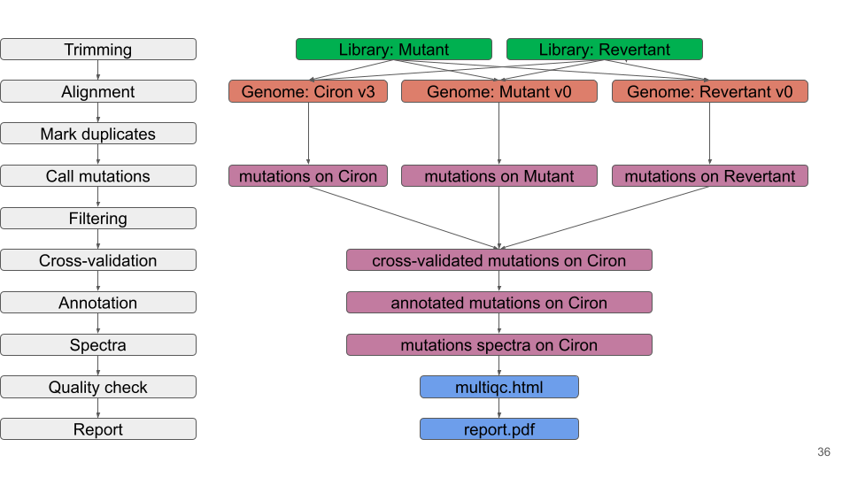

detect Mutations - Faux de Verzy
================
Sylvain Schmitt
April 4, 2022

  - [Installation](#installation)
  - [Usage](#usage)
      - [Locally](#locally)
      - [HPC](#hpc)
  - [Workflow](#workflow)
      - [Reference](#reference)
      - [Reads](#reads)
      - [Alignments](#alignments)
      - [Mutations](#mutations)
      - [Cross validation](#cross-validation)
      - [Annotation](#annotation)
      - [Reports](#reports)

[`singularity` &
`snakemake`](https://github.com/sylvainschmitt/snakemake_singularity)
workflow to detect mutations corresponding in two illumina libraries
from two sectors (mutant and revertant) of accession \#354 sampled on
March 31st 2021 in the Verzy forest.

<div class="figure">



<p class="caption">

Workflow.

</p>

</div>

# Installation

  - [x] Python ≥3.5
  - [x] Snakemake ≥5.24.1
  - [x] Golang ≥1.15.2
  - [x] Singularity ≥3.7.3
  - [x] This workflow

<!-- end list -->

``` bash
# Python
sudo apt-get install python3.5
# Snakemake
sudo apt install snakemake`
# Golang
export VERSION=1.15.8 OS=linux ARCH=amd64  # change this as you need
wget -O /tmp/go${VERSION}.${OS}-${ARCH}.tar.gz https://dl.google.com/go/go${VERSION}.${OS}-${ARCH}.tar.gz && \
sudo tar -C /usr/local -xzf /tmp/go${VERSION}.${OS}-${ARCH}.tar.gz
echo 'export GOPATH=${HOME}/go' >> ~/.bashrc && \
echo 'export PATH=/usr/local/go/bin:${PATH}:${GOPATH}/bin' >> ~/.bashrc && \
source ~/.bashrc
# Singularity
mkdir -p ${GOPATH}/src/github.com/sylabs && \
  cd ${GOPATH}/src/github.com/sylabs && \
  git clone https://github.com/sylabs/singularity.git && \
  cd singularity
git checkout v3.7.3
cd ${GOPATH}/src/github.com/sylabs/singularity && \
  ./mconfig && \
  cd ./builddir && \
  make && \
  sudo make install
# detect Mutations
git clone git@github.com:sylvainschmitt/detectMutations.git
cd detectMutations
git checkout hetre
```

# Usage

## Locally

``` bash
snakemake -np -j 3 --resources mem_mb=10000 # dry run
snakemake --dag | dot -Tsvg > dag/dag.svg # dag
snakemake --use-singularity -j 3 --resources mem_mb=10000 # run
```

## HPC

``` bash
module load bioinfo/snakemake-5.25.0 # for test on node
snakemake -np # dry run
sbatch job.sh # run
snakemake --dag | dot -Tsvg > dag/dag.svg # dag
```

# Workflow

## Reference

*Copy and index reference.*

### [cp\_reference](https://github.com/sylvainschmitt/detectMutations/blob/hetre/rules/cp_reference.smk)

  - Tools: `cp`

### [bwa\_index](https://github.com/sylvainschmitt/detectMutations/blob/hetre/rules/bwa_index.smk)

  - Tools: [`BWA index`](http://bio-bwa.sourceforge.net/bwa.shtml)
  - Singularity:
    oras://registry.forgemia.inra.fr/gafl/singularity/bwa/bwa:latest

## Reads

*Trim and quality check reads.*

### [trimmomatic](https://github.com/sylvainschmitt/detectMutations/blob/hetre/rules/trimmomatic.smk)

  - Tools:
    [`Trimmomatic`](http://www.usadellab.org/cms/uploads/supplementary/Trimmomatic/TrimmomaticManual_V0.32.pdf)
  - Singularity:
    oras://registry.forgemia.inra.fr/gafl/singularity/trimmomatic/trimmomatic:latest

### [fastqc](https://github.com/sylvainschmitt/detectMutations/blob/hetre/rules/fastqc.smk)

  - Tools:
    [`fastQC`](https://www.bioinformatics.babraham.ac.uk/projects/fastqc/Help/)
  - Singularity: docker://biocontainers/fastqc:v0.11.9\_cv8

### [multiqc](https://github.com/sylvainschmitt/detectMutations/blob/hetre/rules/multiqc.smk)

  - Tools: [`MultiQC`](https://multiqc.info/)
  - Singularity:
    oras://registry.forgemia.inra.fr/gafl/singularity/multiqc/multiqc:latest

## Alignments

*Align reads against reference, mark duplicated, and report alignment
quality.*

### [bwa\_mem](https://github.com/sylvainschmitt/detectMutations/blob/hetre/rules/bwa_mem.smk)

  - Tools: [`BWA mem`](http://bio-bwa.sourceforge.net/bwa.shtml)
  - Singularity:
    oras://registry.forgemia.inra.fr/gafl/singularity/bwa/bwa:latest

### [samtools\_view](https://github.com/sylvainschmitt/detectMutations/blob/hetre/rules/samtools_view.smk)

  - Tools: [`Samtools
    view`](http://www.htslib.org/doc/samtools-view.html)
  - Singularity:
    oras://registry.forgemia.inra.fr/gafl/singularity/samtools/samtools:latest

### [samtools\_sort](https://github.com/sylvainschmitt/detectMutations/blob/hetre/rules/samtools_sort.smk)

  - Tools: [`Samtools
    sort`](http://www.htslib.org/doc/samtools-sort.html)
  - Singularity:
    oras://registry.forgemia.inra.fr/gafl/singularity/samtools/samtools:latest

### [samtools\_index](https://github.com/sylvainschmitt/detectMutations/blob/hetre/rules/samtools_index.smk)

  - Tools: [`Samtools
    index`](http://www.htslib.org/doc/samtools-index.html)
  - Singularity:
    oras://registry.forgemia.inra.fr/gafl/singularity/samtools/samtools:latest

### [gatk\_markduplicates](https://github.com/sylvainschmitt/detectMutations/blob/hetre/rules/gatk_markduplicates.smk)

  - Tools: [`gatk
    MarkDuplicates`](https://gatk.broadinstitute.org/hc/en-us/articles/360037052812-MarkDuplicates-Picard-)
  - Singularity: docker://broadinstitute/gatk

### [samtools\_view\_md](https://github.com/sylvainschmitt/detectMutations/blob/hetre/rules/samtools_view_md.smk)

  - Tools: [`Samtools
    view`](http://www.htslib.org/doc/samtools-view.html)
  - Singularity:
    oras://registry.forgemia.inra.fr/gafl/singularity/samtools/samtools:latest

### [samtools\_index\_md](https://github.com/sylvainschmitt/detectMutations/blob/hetre/rules/samtools_index_md.smk)

  - Tools: [`Samtools
    index`](http://www.htslib.org/doc/samtools-index.html)
  - Singularity:
    oras://registry.forgemia.inra.fr/gafl/singularity/samtools/samtools:latest

### [samtools\_stats](https://github.com/sylvainschmitt/detectMutations/blob/hetre/rules/samtools_stats.smk)

  - Tools: [`Samtools
    stats`](http://www.htslib.org/doc/samtools-stats.html)
  - Singularity:
    oras://registry.forgemia.inra.fr/gafl/singularity/samtools/samtools:latest

### [mosdepth](https://github.com/sylvainschmitt/detectMutations/blob/hetre/rules/mosdepth.smk)

  - Tools: [`mosdepth`](https://github.com/brentp/mosdepth)
  - Singularity:
    docker://quay.io/biocontainers/mosdepth:0.2.4–he527e40\_0

## Mutations

*Detect and filter mutations in leaves.*

### [strelka2](https://github.com/sylvainschmitt/detectMutations/blob/hetre/rules/strelka2.smk)

  - Tools: [`Strelka2`](https://github.com/Illumina/strelka)
  - Singularity: docker://quay.io/wtsicgp/strelka2-manta

### [strelka2tsv](https://github.com/sylvainschmitt/detectMutations/blob/hetre/rules/strelka2tsv.smk)

  - Script:
    [`strelka2tsv.R`](https://github.com/sylvainschmitt/detectMutations/blob/hetre/scripts/strelka2tsv.R)
  - Singularity:
    <https://github.com/sylvainschmitt/singularity-r-bioinfo/releases/download/0.0.3/sylvainschmitt-singularity-r-bioinfo.latest.sif>

### [strelka2sql](https://github.com/sylvainschmitt/detectMutations/blob/hetre/rules/strelka2sql.smk)

  - Script:
    [`strelka2sql.R`](https://github.com/sylvainschmitt/detectMutations/blob/hetre/scripts/strelka2sql.R)
  - Singularity:
    <https://github.com/sylvainschmitt/singularity-r-bioinfo/releases/download/0.0.3/sylvainschmitt-singularity-r-bioinfo.latest.sif>

### [filter\_mutations](https://github.com/sylvainschmitt/detectMutations/blob/hetre/rules/filter_mutations.smk)

  - Script:
    [`filter_mutations.R`](https://github.com/sylvainschmitt/detectMutations/blob/hetre/scripts/filter_mutations.R)
  - Singularity:
    <https://github.com/sylvainschmitt/singularity-r-bioinfo/releases/download/0.0.3/sylvainschmitt-singularity-r-bioinfo.latest.sif>

## Cross validation

*Cross-validate mutations on one reference.*

### [mutations2bed](https://github.com/sylvainschmitt/detectMutations/blob/hetre/rules/mutations2bed.smk)

  - Script:
    [`mutations2bed.R`](https://github.com/sylvainschmitt/detectMutations/blob/hetre/scripts/mutations2bed.R)
  - Singularity:
    <https://github.com/sylvainschmitt/singularity-r-bioinfo/releases/download/0.0.3/sylvainschmitt-singularity-r-bioinfo.latest.sif>

### [bedtools\_getfasta](https://github.com/sylvainschmitt/detectMutations/blob/hetre/rules/bedtools_getfasta.smk)

  - Tools: [`bedtools
    getfasta`](https://bedtools.readthedocs.io/en/latest/content/tools/getfasta.html)
  - Singularity:
    oras://registry.forgemia.inra.fr/gafl/singularity/bedtools/bedtools:latest

### [blat](https://github.com/sylvainschmitt/detectMutations/blob/hetre/rules/blat.smk)

  - Tools:
    [`blat`](https://www.ncbi.nlm.nih.gov/pmc/articles/PMC187518/)
  - Singularity:
    docker://quay.io/biocontainers/ucsc-blat:377–ha8a8165\_4

### [psl2pos](https://github.com/sylvainschmitt/detectMutations/blob/hetre/rules/psl2pos.smk)

  - Script:
    [`psl2pos.R`](https://github.com/sylvainschmitt/detectMutations/blob/hetre/scripts/psl2pos.R)
  - Singularity:
    <https://github.com/sylvainschmitt/singularity-r-bioinfo/releases/download/0.0.3/sylvainschmitt-singularity-r-bioinfo.latest.sif>

### [cross\_validate](https://github.com/sylvainschmitt/detectMutations/blob/hetre/rules/cross_validate.smk)

  - Script:
    [`cross_validate.R`](https://github.com/sylvainschmitt/detectMutations/blob/hetre/scripts/cross_validate.R)
  - Singularity:
    <https://github.com/sylvainschmitt/singularity-r-bioinfo/releases/download/0.0.3/sylvainschmitt-singularity-r-bioinfo.latest.sif>

## Annotation

*Annotate mutations with genes, transposable elements, type and
spectra.*

### [genes](https://github.com/sylvainschmitt/detectMutations/blob/hetre/rules/genes.smk)

  - Script:
    [`genes.R`](https://github.com/sylvainschmitt/detectMutations/blob/hetre/scripts/genes.R)
  - Singularity:
    <https://github.com/sylvainschmitt/singularity-r-bioinfo/releases/download/0.0.3/sylvainschmitt-singularity-r-bioinfo.latest.sif>

### [te](https://github.com/sylvainschmitt/detectMutations/blob/hetre/rules/te.smk)

  - Script:
    [`te.R`](https://github.com/sylvainschmitt/detectMutations/blob/hetre/scripts/te.R)
  - Singularity:
    <https://github.com/sylvainschmitt/singularity-r-bioinfo/releases/download/0.0.3/sylvainschmitt-singularity-r-bioinfo.latest.sif>

### [spectra](https://github.com/sylvainschmitt/detectMutations/blob/hetre/rules/spectra.smk)

  - Script:
    [`spectra.R`](https://github.com/sylvainschmitt/detectMutations/blob/hetre/scripts/spectra.R)
  - Singularity:
    <https://github.com/sylvainschmitt/singularity-r-bioinfo/releases/download/0.0.3/sylvainschmitt-singularity-r-bioinfo.latest.sif>

### [join all](https://github.com/sylvainschmitt/detectMutations/blob/hetre/rules/join_all.smk)

  - Script:
    [`join_all.R`](https://github.com/sylvainschmitt/detectMutations/blob/hetre/scripts/join_all.R)
  - Singularity:
    <https://github.com/sylvainschmitt/singularity-r-bioinfo/releases/download/0.0.3/sylvainschmitt-singularity-r-bioinfo.latest.sif>

## Reports

*Combined quality information in one documents and reprort the whole
pipeline.*

### [multiqc](https://github.com/sylvainschmitt/detectMutations/blob/main/rules/multiqc.smk)

  - Tools: [`MultiQC`](https://multiqc.info/)
  - Singularity:
    oras://registry.forgemia.inra.fr/gafl/singularity/multiqc/multiqc:latest

### [report](https://github.com/sylvainschmitt/detectMutations/blob/hetre/rules/report.smk)

  - Script:
    [`report.Rmd`](https://github.com/sylvainschmitt/detectMutations/blob/hetre/scripts/report.Rmd)
  - Singularity:
    <https://github.com/sylvainschmitt/singularity-r-bioinfo/releases/download/0.0.3/sylvainschmitt-singularity-r-bioinfo.latest.sif>
