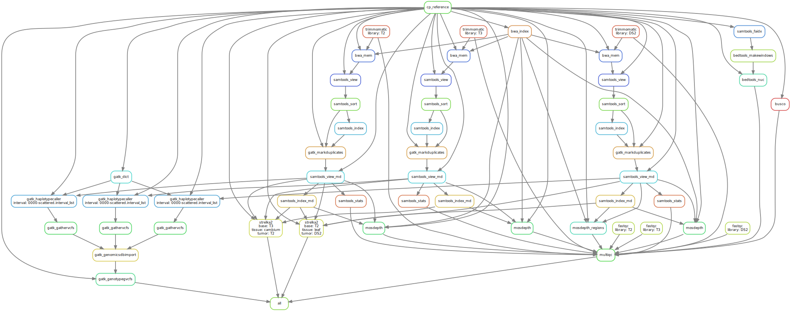

detect Mutations - Swiss data
================
Sylvain Schmitt
April 20, 2021

  - [Installation](#installation)
  - [Usage](#usage)
      - [Get data](#get-data)
      - [Locally](#locally)
      - [HPC](#hpc)
  - [Workflow](#workflow)
      - [Reference](#reference)
      - [Napoleon](#napoleon)
      - [Reads](#reads)
      - [Alignments](#alignments)
      - [Mutations - `Strelka2`](#mutations---strelka2)
      - [Mutations - `GATK`](#mutations---gatk)

[`singularity` &
`snakemake`](https://github.com/sylvainschmitt/snakemake_singularity)
workflow to detect mutations with several alignment and mutation
detection tools.

<!-- -->

# Installation

  - [x] Python ≥3.5
  - [x] Snakemake ≥5.24.1
  - [x] Golang ≥1.15.2
  - [x] Singularity ≥3.7.3
  - [x] This workflow

<!-- end list -->

``` bash
# Python
sudo apt-get install python3.5
# Snakemake
sudo apt install snakemake`
# Golang
export VERSION=1.15.8 OS=linux ARCH=amd64  # change this as you need
wget -O /tmp/go${VERSION}.${OS}-${ARCH}.tar.gz https://dl.google.com/go/go${VERSION}.${OS}-${ARCH}.tar.gz && \
sudo tar -C /usr/local -xzf /tmp/go${VERSION}.${OS}-${ARCH}.tar.gz
echo 'export GOPATH=${HOME}/go' >> ~/.bashrc && \
echo 'export PATH=/usr/local/go/bin:${PATH}:${GOPATH}/bin' >> ~/.bashrc && \
source ~/.bashrc
# Singularity
mkdir -p ${GOPATH}/src/github.com/sylabs && \
  cd ${GOPATH}/src/github.com/sylabs && \
  git clone https://github.com/sylabs/singularity.git && \
  cd singularity
git checkout v3.7.3
cd ${GOPATH}/src/github.com/sylabs/singularity && \
  ./mconfig && \
  cd ./builddir && \
  make && \
  sudo make install
# detect Mutations
git clone git@github.com:sylvainschmitt/detectMutations.git
cd detectMutations
```

# Usage

## Get data

  - Reference genome 3P from
    <http://urgi.versailles.inra.fr/download/oak>
  - Raw reads from ENA project PRJNA327502
  - Napoleon’s genome
    (<https://www.ebi.ac.uk/ena/browser/api/fasta/GCA_003013145.1?download=true&gzip=true>)
  - Napoleon’s original mutations
    (<https://docs.google.com/spreadsheets/d/10SmTGXCfQKU6M8KLqF_lzHDFM4A64pdpVUeNdI7MapA/edit#gid=0>)

<!-- end list -->

``` r
# files
files <- data.frame(
  branch = c("upper", "lower"),
  ncbi = c("SRR386", "SRR388")
) %>% 
  left_join(read_tsv("data/swiss/filereport_read_run_PRJNA327502_tsv.txt") %>% 
              mutate(ncbi = substr(run_accession, 1, 6))) %>% 
  separate(fastq_ftp, c("fastq_ftp_1", "fastq_ftp_2"), sep = ";") %>% 
  filter(!grepl("consensus", fastq_ftp_1)) %>% 
  filter(!grepl("subreads", fastq_ftp_1))

# get reads
files %>% 
  select(branch, fastq_ftp_1, fastq_ftp_2) %>% 
  reshape2::melt("branch") %>% 
  mutate(command = paste0("wget ", value)) %>% 
  select(command) %>% 
  write_tsv(file = "data/swiss/get_reads.sh", col_names = F)

# merge reads
files %>% 
  select(branch, run_accession) %>% 
  mutate(`1` = paste0(run_accession, "_1.fastq.gz"), `2` = paste0(run_accession, "_2.fastq.gz")) %>% 
  dplyr::select(branch, `1`, `2`) %>% 
  group_by(branch) %>% 
  summarise(`1` = paste(`1`, collapse = " "),
            `2` = paste(`2`, collapse = " ")) %>% 
  reshape2::melt("branch", variable.name = "strand", value.name = "command") %>% 
  mutate(command = paste0("zcat ", command, " | gzip > ", branch, "_", strand, ".fastq.gz ; rm ", command)) %>% 
  select(-branch, -strand) %>% 
  write_tsv(file = "data/swiss/merge_reads.sh", col_names = F)
```

``` bash
cd data/swiss
sh get_genome.sh 
mkdir out
sarray -J swissData -o out/%j.out -e out/%j.err -t 1:00:00 --mail-type=ALL  get_reads.sh
sarray -J swissData -o out/%j.out -e out/%j.err -t 1:00:00 --mail-type=ALL  merge_reads.sh
rm -rf out
```

## Locally

``` bash
snakemake -np -j 3 --resources mem_mb=10000 # dry run
snakemake --dag | dot -Tsvg > dag/dag.svg # dag
snakemake --use-singularity -j 3 --resources mem_mb=10000 # run
```

## HPC

``` bash
module load bioinfo/snakemake-5.25.0 # for test on node
snakemake -np # dry run
sbatch job.sh # run
snakemake --dag | dot -Tsvg > dag/dag.svg # dag
```

# Workflow

## Reference

*Copy and index reference for software to work with.*

### [cp\_reference](https://github.com/sylvainschmitt/detectMutations/blob/swiss/rules/cp_reference.smk)

  - Tools: `cp`

### [bwa\_index](https://github.com/sylvainschmitt/detectMutations/blob/swiss/rules/bwa_index.smk)

  - Tools: [`BWA index`](http://bio-bwa.sourceforge.net/bwa.shtml)
  - Singularity:
    oras://registry.forgemia.inra.fr/gafl/singularity/bwa/bwa:latest

### [samtools\_faidx](https://github.com/sylvainschmitt/detectMutations/blob/swiss/rules/samtools_faidx.smk)

  - Tools: [`samtools
    faidx`](http://www.htslib.org/doc/samtools-faidx.html)
  - Singularity:
    oras://registry.forgemia.inra.fr/gafl/singularity/samtools/samtools:latest

### [gatk\_dict](https://github.com/sylvainschmitt/detectMutations/blob/swiss/rules/gatk_dict.smk)

  - Tools: [`gatk
    CreateSequenceDictionary`](https://gatk.broadinstitute.org/hc/en-us/articles/360036729911-CreateSequenceDictionary-Picard-)
  - Singularity: docker://broadinstitute/gatk

## Napoleon

*Get the position of original mutations from Napoleon on the 3P genome.*

### [cp\_napo](https://github.com/sylvainschmitt/detectMutations/blob/swiss/rules/cp_napo.smk)

  - Tools: `cp`

### [samtools\_faidx\_napo](https://github.com/sylvainschmitt/detectMutations/blob/swiss/rules/samtools_faidx_napo.smk)

  - Tools: [`samtools
    faidx`](http://www.htslib.org/doc/samtools-faidx.html)
  - Singularity:
    oras://registry.forgemia.inra.fr/gafl/singularity/samtools/samtools:latest

### [napomutations2bed](https://github.com/sylvainschmitt/detectMutations/blob/swiss/rules/napomutations2bed.smk)

  - Script:
    [`napomutations2bed.R`](https://github.com/sylvainschmitt/detectMutations/blob/swiss/scripts/napomutations2bed.R)
  - Singularity: to be added, currently uses local install

### [bedtools\_getfasta](https://github.com/sylvainschmitt/detectMutations/blob/swiss/rules/bedtools_getfasta.smk)

  - Tools: [`bedtools
    getfasta`](https://bedtools.readthedocs.io/en/latest/content/tools/getfasta.html)
  - Singularity:
    oras://registry.forgemia.inra.fr/gafl/singularity/bedtools/bedtools:latest

### [blat](https://github.com/sylvainschmitt/detectMutations/blob/swiss/rules/blat.smk)

  - Tools: [\`blat](http://genome.ucsc.edu/FAQ/FAQblat.html)
  - Singularity: to be added, currently uses local install

### [psl2pos](https://github.com/sylvainschmitt/detectMutations/blob/swiss/rules/psl2pos.smk)

  - Script:
    [`psl2pos.R`](https://github.com/sylvainschmitt/detectMutations/blob/swiss/scripts/psl2pos.R)
  - Singularity: to be added, currently uses local install

## Reads

*Copy reads, report quality and trim.*

### [cp\_reads](https://github.com/sylvainschmitt/detectMutations/blob/swiss/rules/cp_reads.smk)

  - Tools: `cp`

### [trimmomatic](https://github.com/sylvainschmitt/detectMutations/blob/swiss/rules/trimmomatic.smk)

  - Tools:
    [`Trimmomatic`](http://www.usadellab.org/cms/uploads/supplementary/Trimmomatic/TrimmomaticManual_V0.32.pdf)
  - Singularity:
    oras://registry.forgemia.inra.fr/gafl/singularity/trimmomatic/trimmomatic:latest

## Alignments

*Align reads against reference, mark duplicated, and report alignment
quality.*

### [bwa\_mem](https://github.com/sylvainschmitt/detectMutations/blob/swiss/rules/bwa_mem.smk)

  - Tools: [`BWA mem`](http://bio-bwa.sourceforge.net/bwa.shtml)
  - Singularity:
    oras://registry.forgemia.inra.fr/gafl/singularity/bwa/bwa:latest

### [samtools\_view](https://github.com/sylvainschmitt/detectMutations/blob/swiss/rules/samtools_view.smk)

  - Tools: [`Samtools
    view`](http://www.htslib.org/doc/samtools-view.html)
  - Singularity:
    oras://registry.forgemia.inra.fr/gafl/singularity/samtools/samtools:latest

### [samtools\_sort](https://github.com/sylvainschmitt/detectMutations/blob/swiss/rules/samtools_sort.smk)

  - Tools: [`Samtools
    sort`](http://www.htslib.org/doc/samtools-sort.html)
  - Singularity:
    oras://registry.forgemia.inra.fr/gafl/singularity/samtools/samtools:latest

### [samtools\_index](https://github.com/sylvainschmitt/detectMutations/blob/swiss/rules/samtools_index.smk)

  - Tools: [`Samtools
    index`](http://www.htslib.org/doc/samtools-index.html)
  - Singularity:
    oras://registry.forgemia.inra.fr/gafl/singularity/samtools/samtools:latest

### [gatk\_markduplicates](https://github.com/sylvainschmitt/detectMutations/blob/swiss/rules/gatk_markduplicates.smk)

  - Tools: [`gatk
    MarkDuplicates`](https://gatk.broadinstitute.org/hc/en-us/articles/360037052812-MarkDuplicates-Picard-)
  - Singularity: docker://broadinstitute/gatk

### [samtools\_view\_md](https://github.com/sylvainschmitt/detectMutations/blob/swiss/rules/samtools_view_md.smk)

  - Tools: [`Samtools
    view`](http://www.htslib.org/doc/samtools-view.html)
  - Singularity:
    oras://registry.forgemia.inra.fr/gafl/singularity/samtools/samtools:latest

### [samtools\_index\_md](https://github.com/sylvainschmitt/detectMutations/blob/swiss/rules/samtools_index_md.smk)

  - Tools: [`Samtools
    index`](http://www.htslib.org/doc/samtools-index.html)
  - Singularity:
    oras://registry.forgemia.inra.fr/gafl/singularity/samtools/samtools:latest

## Mutations - `Strelka2`

### [strelka2](https://github.com/sylvainschmitt/detectMutations/blob/swiss/rules/strelka2.smk)

  - Tools: [`Strelka2`](https://github.com/Illumina/strelka)
  - Singularity: docker://quay.io/wtsicgp/strelka2-manta

### [strelka2tsv](https://github.com/sylvainschmitt/detectMutations/blob/swiss/rules/strelka2tsv.smk)

  - Script:
    [`strelka2tsv.R`](https://github.com/sylvainschmitt/detectMutations/blob/swiss/scripts/strelka2tsv.R)
  - Singularity: to be added, currently uses local install

### [strelka2sql](https://github.com/sylvainschmitt/detectMutations/blob/swiss/rules/strelka2sql.smk)

  - Script:
    [`strelka2sql.R`](https://github.com/sylvainschmitt/detectMutations/blob/swiss/scripts/strelka2sql.R)
  - Singularity: to be added, currently uses local install

## Mutations - `GATK`

Using [Best
Practice](https://gatk.broadinstitute.org/hc/en-us/articles/360035535932-Germline-short-variant-discovery-SNPs-Indels-)
& [Hard
filtering](https://gatk.broadinstitute.org/hc/en-us/articles/360035531112--How-to-Filter-variants-either-with-VQSR-or-by-hard-filtering#2).

### [gatk\_haplotypecaller](https://github.com/sylvainschmitt/detectMutations/blob/swiss/rules/gatk_haplotypecaller.smk)

  - Tools: [`gatk
    HaplotypeCaller`](https://gatk.broadinstitute.org/hc/en-us/articles/360037225632-HaplotypeCaller)
  - Singularity: docker://broadinstitute/gatk

### [gatk\_gathervcfs](https://github.com/sylvainschmitt/detectMutations/blob/swiss/rules/gatk_gathervcfs.smk)

  - Tools: [`gatk
    GatherVcfs`](https://gatk.broadinstitute.org/hc/en-us/articles/360037422071-GatherVcfs-Picard-)
  - Singularity: docker://broadinstitute/gatk

### [gatk\_selectsnps](https://github.com/sylvainschmitt/detectMutations/blob/swiss/rules/gatk_selectsnps.smk)

  - Tools: [`gatk SelectVariants -select-type
    SNP`](https://gatk.broadinstitute.org/hc/en-us/articles/360037055952-SelectVariants)
  - Singularity: docker://broadinstitute/gatk

### [gatk\_variantfiltration](https://github.com/sylvainschmitt/detectMutations/blob/swiss/rules/gatk_variantfiltration.smk)

  - Tools: [`gatk
    VariantFiltration`](https://gatk.broadinstitute.org/hc/en-us/articles/360037434691-VariantFiltration)
  - Singularity: docker://broadinstitute/gatk

### [gatk\_selectfiltered](https://github.com/sylvainschmitt/detectMutations/blob/swiss/rules/gatk_selectfiltered.smk)

  - Tools: [`gatk SelectVariants
    --exclude-filtered`](https://gatk.broadinstitute.org/hc/en-us/articles/360037055952-SelectVariants)
  - Singularity: docker://broadinstitute/gatk

### [gatk2tsv](https://github.com/sylvainschmitt/detectMutations/blob/swiss/rules/gatk2tsv.smk)

  - Script:
    [`gatk2tsv.R`](https://github.com/sylvainschmitt/detectMutations/blob/swiss/scripts/gatk2tsv.R)
  - Singularity: to be added, currently uses local install

### [gatk2sql](https://github.com/sylvainschmitt/detectMutations/blob/swiss/rules/gatk2sql.smk)

  - Script:
    [`gatk2sql.R`](https://github.com/sylvainschmitt/detectMutations/blob/swiss/scripts/gatk2sql.R)
  - Singularity: to be added, currently uses local install
