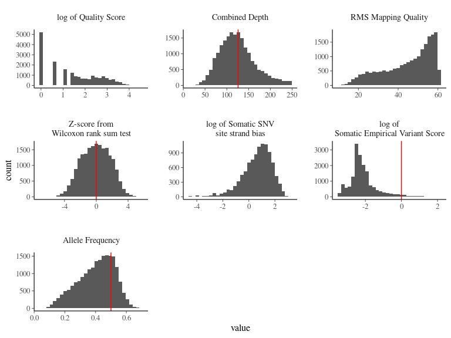
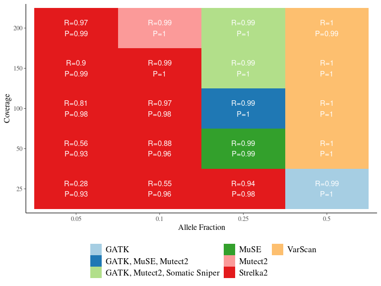

detect Mutations
================
Sylvain Schmitt
April 20, 2021

  - [Installation](#installation)
  - [Usage](#usage)
      - [Get data](#get-data)
      - [Locally](#locally)
      - [HPC](#hpc)
  - [Workflow](#workflow)
      - [Reference](#reference)
      - [Reads](#reads)
      - [Alignments](#alignments)
      - [Detection](#detection)
      - [Mutations](#mutations)
      - [Quality check](#quality-check)
  - [Results](#results)
  - [Miscellaneous](#miscellaneous)
      - [Unused callers](#unused-callers)

[`singularity` &
`snakemake`](https://github.com/sylvainschmitt/snakemake_singularity)
workflow to detect mutations with several alignment and mutation
detection tools.

<!-- -->

# Installation

  - [x] Python ≥3.5
  - [x] Snakemake ≥5.24.1
  - [x] Golang ≥1.15.2
  - [x] Singularity ≥3.7.3
  - [x] This workflow

<!-- end list -->

``` bash
# Python
sudo apt-get install python3.5
# Snakemake
sudo apt install snakemake`
# Golang
export VERSION=1.15.8 OS=linux ARCH=amd64  # change this as you need
wget -O /tmp/go${VERSION}.${OS}-${ARCH}.tar.gz https://dl.google.com/go/go${VERSION}.${OS}-${ARCH}.tar.gz && \
sudo tar -C /usr/local -xzf /tmp/go${VERSION}.${OS}-${ARCH}.tar.gz
echo 'export GOPATH=${HOME}/go' >> ~/.bashrc && \
echo 'export PATH=/usr/local/go/bin:${PATH}:${GOPATH}/bin' >> ~/.bashrc && \
source ~/.bashrc
# Singularity
mkdir -p ${GOPATH}/src/github.com/sylabs && \
  cd ${GOPATH}/src/github.com/sylabs && \
  git clone https://github.com/sylabs/singularity.git && \
  cd singularity
git checkout v3.7.3
cd ${GOPATH}/src/github.com/sylabs/singularity && \
  ./mconfig && \
  cd ./builddir && \
  make && \
  sudo make install
# detect Mutations
git clone git@github.com:sylvainschmitt/detectMutations.git
cd detectMutations
```

# Usage

## Get data

*Generate data using the [generate
Mutations](https://github.com/sylvainschmitt/generateMutations)
workflow.*

``` bash
git clone git@github.com:sylvainschmitt/generateMutations.git
cd ../generateMutations
snakemake --use-singularity --cores 4
cd ../detectMutations
bash scripts/get_data.sh
```

## Locally

``` bash
snakemake -np # dry run
snakemake --dag | dot -Tsvg > dag/dag.svg # dag
snakemake --use-singularity --cores 4 # run
snakemake --use-singularity --cores 1 --verbose # debug
snakemake --report report.html # report
```

## HPC

``` bash
module purge ; module load bioinfo/snakemake-5.25.0 # for test on node
snakemake -np # dry run
sbatch job.sh ; watch 'squeue -u sschmitt' # run
less detMut.*.err # snakemake outputs, use MAJ+F
less detMut.*.out # snakemake outputs, use MAJ+F
snakemake --dag | dot -Tsvg > dag/dag.svg # dag
module purge ; module load bioinfo/snakemake-5.8.1 ; module load system/Python-3.6.3 # for report
snakemake --report report.html # report
module purge ; module load system/R-3.6.2 ; R # to build results
```

# Workflow

## Reference

*Copy and index reference and SNPs for software to work with.*

### [cp\_reference](https://github.com/sylvainschmitt/detectMutations/blob/main/rules/cp_reference.smk)

  - Tools: `cp`

### [bwa\_index](https://github.com/sylvainschmitt/detectMutations/blob/main/rules/bwa_index.smk)

  - Tools: [`BWA index`](http://bio-bwa.sourceforge.net/bwa.shtml)
  - Singularity:
    oras://registry.forgemia.inra.fr/gafl/singularity/bwa/bwa:latest

### [samtools\_faidx](https://github.com/sylvainschmitt/detectMutations/blob/main/rules/samtools_faidx.smk)

  - Tools: [`samtools
    faidx`](http://www.htslib.org/doc/samtools-faidx.html)
  - Singularity:
    oras://registry.forgemia.inra.fr/gafl/singularity/samtools/samtools:latest

### [gatk\_dict](https://github.com/sylvainschmitt/detectMutations/blob/main/rules/gatk_dict.smk)

  - Tools: [`gatk
    CreateSequenceDictionary`](https://gatk.broadinstitute.org/hc/en-us/articles/360036729911-CreateSequenceDictionary-Picard-)
  - Singularity: docker://broadinstitute/gatk

### [cp\_snps](https://github.com/sylvainschmitt/detectMutations/blob/main/rules/cp_snps.smk)

  - Tools: `cp`

### [gatk\_idx](https://github.com/sylvainschmitt/detectMutations/blob/main/rules/gatk_idx.smk)

  - Tools: [`gatk
    IndexFeatureFile`](https://gatk.broadinstitute.org/hc/en-us/articles/360037428111-IndexFeatureFile)
  - Singularity: docker://broadinstitute/gatk

## Reads

*Copy reads, report quality and trim.*

### [cp\_reads](https://github.com/sylvainschmitt/detectMutations/blob/main/rules/cp_reads.smk)

  - Tools: `cp`

### [trimmomatic](https://github.com/sylvainschmitt/detectMutations/blob/main/rules/trimmomatic.smk)

  - Tools:
    [`Trimmomatic`](http://www.usadellab.org/cms/uploads/supplementary/Trimmomatic/TrimmomaticManual_V0.32.pdf)
  - Singularity:
    oras://registry.forgemia.inra.fr/gafl/singularity/trimmomatic/trimmomatic:latest

## Alignments

*Align reads against reference, mark duplicated, and report alignment
quality.*

### [bwa\_mem](https://github.com/sylvainschmitt/detectMutations/blob/main/rules/bwa_mem.smk)

  - Tools: [`BWA mem`](http://bio-bwa.sourceforge.net/bwa.shtml)
  - Singularity:
    oras://registry.forgemia.inra.fr/gafl/singularity/bwa/bwa:latest

### [samtools\_sort](https://github.com/sylvainschmitt/detectMutations/blob/main/rules/samtools_sort.smk)

  - Tools: [`Samtools
    sort`](http://www.htslib.org/doc/samtools-sort.html)
  - Singularity:
    oras://registry.forgemia.inra.fr/gafl/singularity/samtools/samtools:latest

### [samtools\_index](https://github.com/sylvainschmitt/detectMutations/blob/main/rules/samtools_index.smk)

  - Tools: [`Samtools
    index`](http://www.htslib.org/doc/samtools-index.html)
  - Singularity:
    oras://registry.forgemia.inra.fr/gafl/singularity/samtools/samtools:latest

### [gatk\_markduplicates](https://github.com/sylvainschmitt/detectMutations/blob/main/rules/gatk_markduplicates.smk)

  - Tools: [`gatk
    MarkDuplicates`](https://gatk.broadinstitute.org/hc/en-us/articles/360037052812-MarkDuplicates-Picard-)
  - Singularity: docker://broadinstitute/gatk

### [samtools\_index\_md](https://github.com/sylvainschmitt/detectMutations/blob/main/rules/samtools_index_md.smk)

  - Tools: [`Samtools
    index`](http://www.htslib.org/doc/samtools-index.html)
  - Singularity:
    oras://registry.forgemia.inra.fr/gafl/singularity/samtools/samtools:latest

### [samtools\_mpileup](https://github.com/sylvainschmitt/detectMutations/blob/main/rules/samtools_mpileup.smk)

  - Tools: [`Samtools
    mpileup`](http://www.htslib.org/doc/samtools-mpileup.html)
  - Singularity:
    oras://registry.forgemia.inra.fr/gafl/singularity/samtools/samtools:latest

## Detection

*Detect mutations.*

#### [gatk\_mutect2](https://github.com/sylvainschmitt/detectMutations/blob/main/rules/gatk_mutect2.smk)

  - Tools: [`gatk
    Mutect2`](https://gatk.broadinstitute.org/hc/en-us/articles/360037593851-Mutect2)
  - Singularity: docker://broadinstitute/gatk

#### [freebayes](https://github.com/sylvainschmitt/detectMutations/blob/main/rules/freebayes.smk)

  - Tools: [`freebayes`](https://github.com/freebayes/freebayes)
  - Singularity:
    oras://registry.forgemia.inra.fr/gafl/singularity/freebayes/freebayes:latest

#### [gatk\_haplotypecaller](https://github.com/sylvainschmitt/detectMutations/blob/main/rules/gatk_haplotypecaller.smk)

  - Tools: [`gatk
    HaplotypeCaller`](https://gatk.broadinstitute.org/hc/en-us/articles/360037225632-HaplotypeCaller)
  - Singularity: docker://broadinstitute/gatk

#### [gatk\_genotypegvcfs](https://github.com/sylvainschmitt/detectMutations/blob/main/rules/gatk_genotypegvcfs.smk)

  - Tools: [`gatk
    GenotypeGVCFs`](https://gatk.broadinstitute.org/hc/en-us/articles/360037057852-GenotypeGVCFs)
  - Singularity: docker://broadinstitute/gatk

#### [strelka2](https://github.com/sylvainschmitt/detectMutations/blob/main/rules/strelka2.smk)

  - Tools: [`Strelka2`](https://github.com/Illumina/strelka)
  - Singularity: docker://quay.io/wtsicgp/strelka2-manta

#### [varscan](https://github.com/sylvainschmitt/detectMutations/blob/main/rules/varscan.smk)

  - Tools:
    [`VarScan`](https://wiki.bits.vib.be/index.php/Varscan2#calling_SNVs)
  - Singularity: docker://alexcoppe/varscan

#### [varscan2vcf](https://github.com/sylvainschmitt/detectMutations/blob/main/rules/varscan2vcf.smk)

  - Script:
    [`varscan2vcf.R`](https://github.com/sylvainschmitt/detectMutations/blob/main/scripts/varscan2vcf.R)
  - Singularity:
    <https://github.com/sylvainschmitt/singularity-template/releases/download/0.0.1/sylvainschmitt-singularity-tidyverse-Biostrings.latest.sif>

#### [somaticsniper](https://github.com/sylvainschmitt/detectMutations/blob/main/rules/somaticsniper.smk)

  - Tools: [`Somatic
    Sniper`](http://gmt.genome.wustl.edu/packages/somatic-sniper/)
  - Singularity: docker://lethalfang/somaticsniper:1.0.5.0

#### [muse](https://github.com/sylvainschmitt/detectMutations/blob/main/rules/muse.smk)

  - Tools:
    [`MuSe`](https://bioinformatics.mdanderson.org/public-software/muse/)
  - Singularity: docker://opengenomics/muse

## Mutations

#### [cp\_vcfs](https://github.com/sylvainschmitt/detectMutations/blob/main/rules/cp_vcfs.smk)

  - Tools: `cp`

#### [bedtools\_substract](https://github.com/sylvainschmitt/detectMutations/blob/main/rules/bedtools_substract.smk)

  - Tools: [`bedtools
    substract`](https://bedtools.readthedocs.io/en/latest/content/tools/subtract.html)
  - Singularity:
    oras://registry.forgemia.inra.fr/gafl/singularity/bedtools/bedtools:latest

## Quality check

*Combined quality information from `QualiMap`, `Picard`, `Samtools`,
`Trimmomatic`, and `FastQC` (see previous steps).*

### [fastqc](https://github.com/sylvainschmitt/detectMutations/blob/main/rules/fastqc.smk)

  - Tools:
    [`fastQC`](https://www.bioinformatics.babraham.ac.uk/projects/fastqc/Help/)
  - Singularity: docker://biocontainers/fastqc:v0.11.9\_cv8

### [samtools\_stats](https://github.com/sylvainschmitt/detectMutations/blob/main/rules/samtools_stats.smk)

  - Tools: [`Samtools
    stats`](http://www.htslib.org/doc/samtools-stats.html)
  - Singularity:
    oras://registry.forgemia.inra.fr/gafl/singularity/samtools/samtools:latest

### [qualimap](https://github.com/sylvainschmitt/detectMutations/blob/main/rules/qualimap.smk)

  - Tools:
    [`QualiMap`](http://qualimap.conesalab.org/doc_html/command_line.html)
  - Singularity: docker://pegi3s/qualimap

### [multiqc](https://github.com/sylvainschmitt/detectMutations/blob/main/rules/multiqc.smk)

  - Tools: [`MultiQC`](https://multiqc.info/)
  - Singularity:
    oras://registry.forgemia.inra.fr/gafl/singularity/multiqc/multiqc:latest

# Results

<!-- -->

<!-- -->

# Miscellaneous

*Due to bug, poor performance, or slow speed.*

## Unused callers

#### [manta](https://github.com/sylvainschmitt/detectMutations/blob/main/rules/manta.smk)

  - Tools: [`Manta`](https://github.com/Illumina/manta)
  - Singularity: docker://quay.io/wtsicgp/strelka2-manta

#### [caveman](https://github.com/sylvainschmitt/detectMutations/blob/main/rules/caveman.smk)

  - Tools: [`CaVEMan`](https://github.com/cancerit/CaVEMan)
  - Singularity: docker://leukgen/docker-caveman:v1.0.0

#### [radia](https://github.com/sylvainschmitt/detectMutations/blob/main/rules/radia.smk)

  - Tools: [`RADIA`](https://github.com/aradenbaugh/radia/)
  - Singularity: docker://opengenomics/radia

#### [octopus](https://github.com/sylvainschmitt/detectMutations/blob/main/rules/octopussmk)

  - Tools: [`octopus`](https://github.com/luntergroup/octopus)
  - Singularity:
    <https://github.com/sylvainschmitt/singularity-octopus/releases/download/0.0.1/sylvainschmitt-singularity-octopus.latest.sif>
